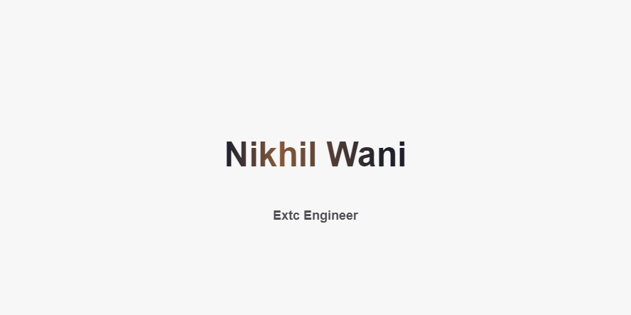

# NIKHIL WANI

  

<!--

🔭 I’m currently Studying  &nbsp;&nbsp;&nbsp;&nbsp;&nbsp;&nbsp;&nbsp;&nbsp;&nbsp;&nbsp; 🌱 I’m currently learning Python

📫 How to reach me: <a href="https://www.linkedin.com/in/nikhil-wani-ba2360137/">Linkedin</a>  &nbsp;&nbsp;&nbsp;  💬 Ask me about Anything

😄 Pronouns: He/His  &nbsp;&nbsp;&nbsp; &nbsp; &nbsp; &nbsp;&nbsp;&nbsp;&nbsp;&nbsp;&nbsp;&nbsp;&nbsp;&nbsp;&nbsp;&nbsp;⚡ Fact: Loves to Travel..
-->
### About

 I'm a Electronics and Telecommunications Engineer whose passion lies in computer programming. In my work as an engineer I've had to use a lot of counter intuitive software. Curious as to why these programs worked the way they do, I started learning how to code. As i started learning I've came across many technologies. One that amazed me is how an AI provides systems the ability to automatically learn and improve from experience without being explicitly programmed.

### Skills

C / C++ / Java / Python / R / GO / SQL / Mongodb / Nodejs / Cloud Computing 

 ### Stats

  

 <!--   -->

### Contact

